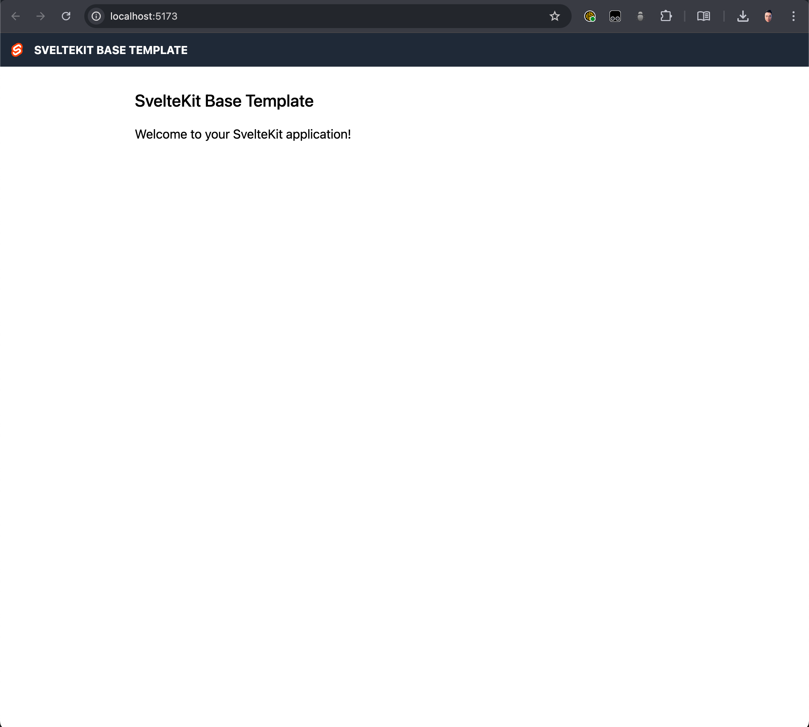

# SvelteKit Base Template

A starter template for SvelteKit projects, pre-packaged with Tailwind and Prettier.

## What's included?

- Tailwind, made available globally with postcss
- Prettier
- Favicon
- Sass (`.scss` syntax)
- An example `<Header>` component with site logo and title
- Adapter node for ease of remote deployment

## Preview



## Getting started

Install the dependencies:

```
yarn install
```

Run the app in development mode:

```
yarn run dev
```

Or, run the app in production mode:

```
yarn start
```
